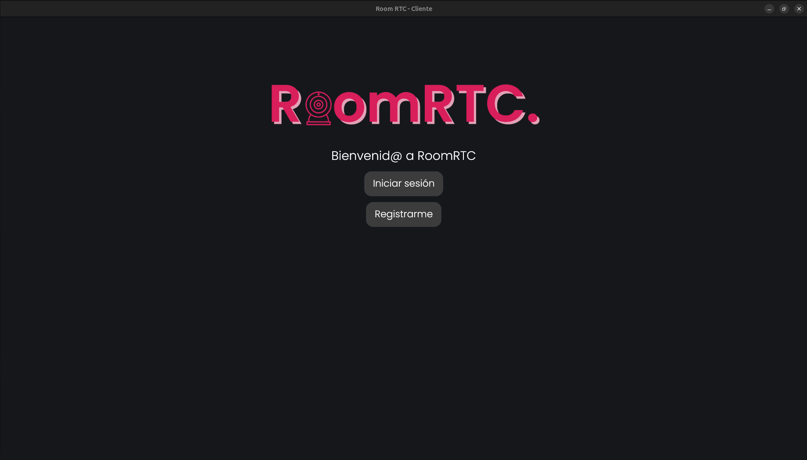
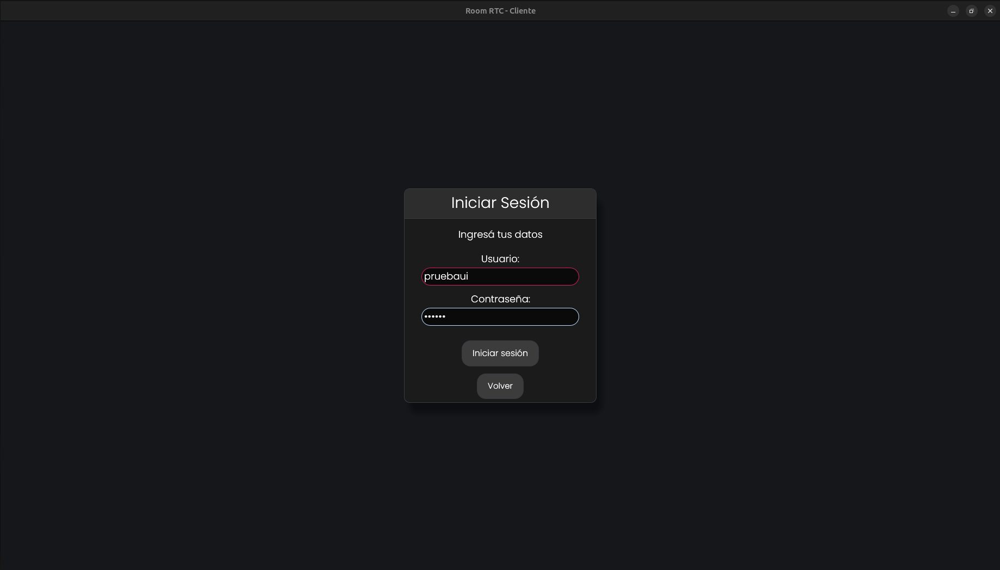
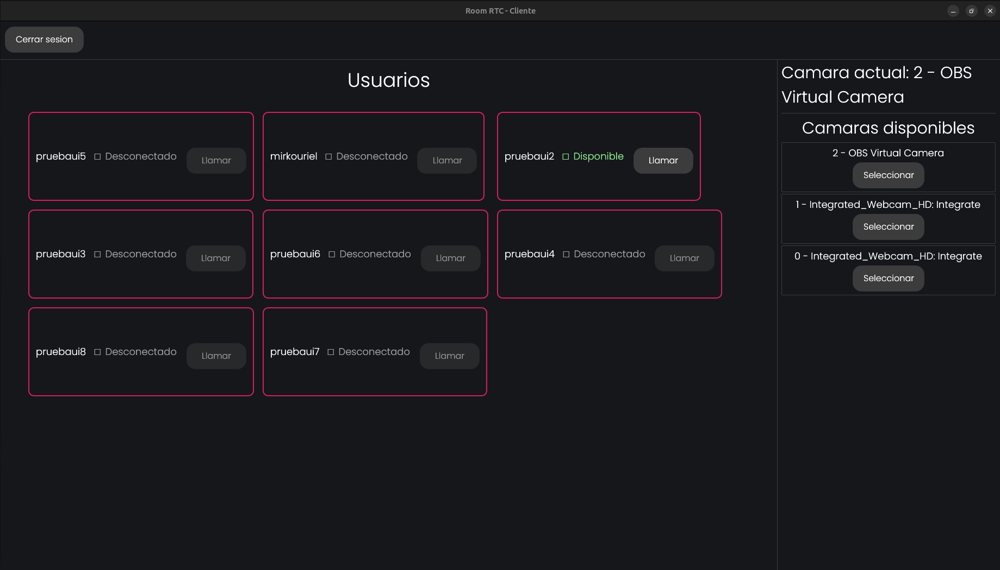
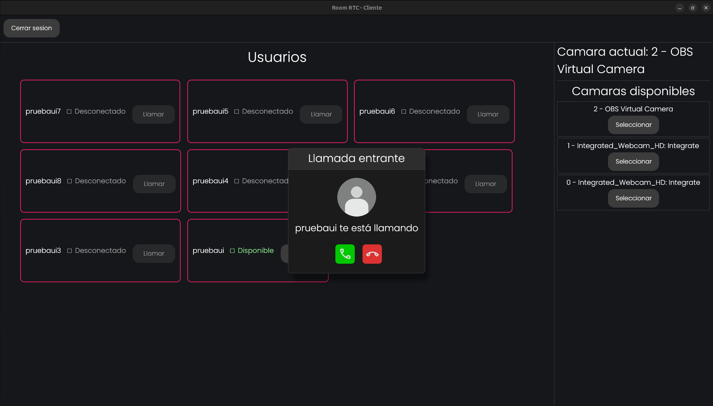
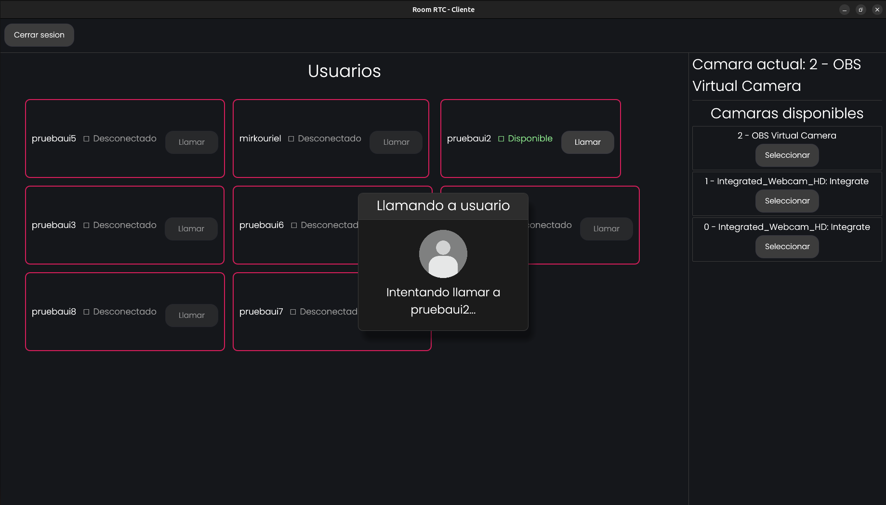
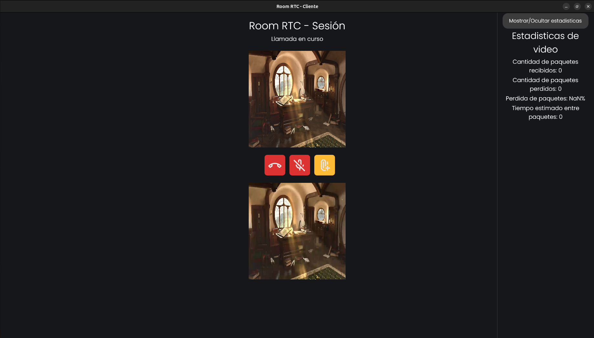

# Proyecto: RoomRTC
El proyecto **RoomRTC** es un sistema que permite realizar videoconferencias entre dos usuarios en distintos dispositivos.

El sistema cuenta con una implementacion propia de [WebRTC](https://webrtc.org/?hl=es-419). Siendo esta una serie de protocolos que permiten la transmisión de video y audio en tiempo real. 

### Funcionalidades principales

- Comunicación peer-to-peer entre dos usuarios.
- Transmisión de audio y video en tiempo real.
- Establecimiento de conexión mediante servidor de señalización.
- Negociación de conexión usando SDP e ICE.
- Canales seguros mediante DTLS.
- Envío de medios con SRTP.
- Comunicación de datos y envío de archivos mediante SCTP / Data Channels.
- Interfaz gráfica para interacción del usuario.

### Arquitectura general
El sistema se compone de dos partes principales:
#### Servidor central
Encargado de la señalización entre usuarios (registro, login y coordinación inicial de la llamada).

#### Cliente (RoomRTC)
Permite a los usuarios conectarse al servidor, iniciar o aceptar llamadas y realizar la comunicación directa entre peers.
Una vez completada la señalización, la comunicación de audio, video y datos se realiza de forma directa entre los peers, sin pasar por el servidor.

## Como usar 

### Servidor
 Se cuenta con un **servidor central** el cual se encarga de gestionar los requerimientos de los distintos usuarios.

 Para iniciarlo se debe ejecutar:

 ```
 cargo run --bin servidor  -- archivos_test/config/servidor.conf
 ```

 ### Usuario
 Si se quiere iniciar un nuevo usuario el cual se conectara al servidor se debe ejecutar:

 ```
 cargo run --bin room-rtc  -- archivos_test/config/peer1.conf
 ```

## Como testear
 ```
 cargo test
 ```

## Pantallas
### Pantalla inicio

### Pantalla login

### Pantalla lobby

#### Siendo llamado

#### Llamando

### Pantalla llamada


 -----------------------------
### **Taller de Programacion - Grupo 25** 
#### Facultad de Ingeniería, Universidad de Buenos Aires
### Integrantes
- García Lapegna, Melanie Belén ~ Padrón: 111848
- Rivas, Sofia Belen ~ Padrón: 112216
- Sáenz Valiente, Mirko Uriel ~ Padrón: 111960

Link a presentación final: [Link](https://www.canva.com/design/DAHCvci7ggA/ZitRRPt6MgWDd5WSUe7QKA/view?utm_content=DAHCvci7ggA&utm_campaign=designshare&utm_medium=link2&utm_source=uniquelinks&utlId=hfb518aaa46)
